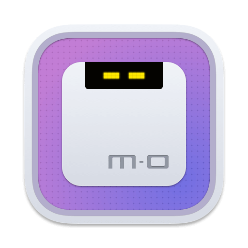

# Motrix

<a href="https://motrix.app">
  
</a>


Motrix는 HTTP, FTP, BitTorrent, Magnet 등의 다운로드를 지원하는 완전한 기능의 다운로드 관리자입니다.

Motrix는 깨끗하고 사용하기 쉬운 인터페이스를 가지고 있습니다.

## 설치
```sudo apt install motrix```

---
## 빌드 환경 설치
- 빌드 버전 변경시 package.json의 version을 고쳐야 한다.

### npm 설치
```
sudo apt install npm
```

### yarn 설치
```
sudo npm install yarn
```
  
### nodejs 설치
```
※ 빌드 버전 요구에 따라 14를 12, 13 등으로 바꿀 필요가 있음

curl -sL https://deb.nodesource.com/setup_14.x | sudo -E bash -

sudo apt install nodejs

```

### motrix depends 설치

```
git clone git@github.com:agalwood/Motrix.git

cd motrix

yarn
```
## 빌드
- 빌드시 rpm 관련 오류가 날 수 있습니다.
- deb 패키지는 문제없이 빌드 됩니다.
```
yarn run build
```

### deb 패키지 추가 작업
- electron 빌드는 다음과 같이 mime icon과 관련한 설정을 리눅스에서는 지원을 하지 않습니다.
- https://www.electron.build/configuration/configuration.html
- 수동으로 파일을 넣어주는 작업을 진행해야 되는데 간편한 해결을 위한 스크립트로 진행할 수 있습니다.
```
sudo ./fixbuild.sh
```

### 빌드완료
```
release/hamonikr_release/Motrix_{RELEASE}_amd64.deb 확인
```